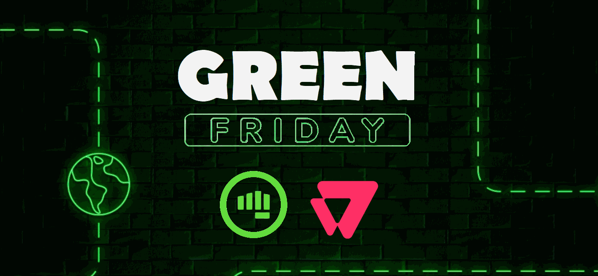

# Landing Page | Desafio Gama Academy

Projeto integrante do curso de Programação Hiring Coders, realizado pela Gama Academy em parceria com a VTEX.

O objetivo do projeto é criar uma landing page com o tema da "Black Friday" onde o usuário irá inserir seus dados no formulário para se cadastrar na promoção.

Eu acabei criando uma página chamada de "Green Friday", em alusão à cor principal da Gama Academy.

Os dados inseridos no formulário são armazenados no Local Storage.

O deploy do projeto foi feito na Netlify e o resultado final pode ser conferido [clicando aqui](https://green-friday-hiring-coders.netlify.app/) ou no gif abaixo:

## Tecnologias utilizadas:
:small_orange_diamond: HTML5

:small_blue_diamond: CSS3

:warning: JavaScript

## Status: Finalizado :heavy_check_mark:

